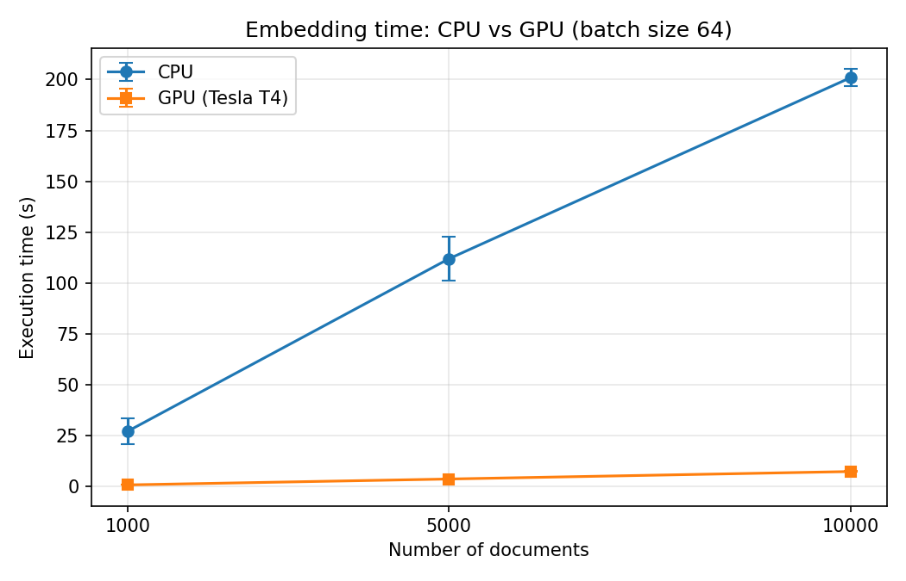
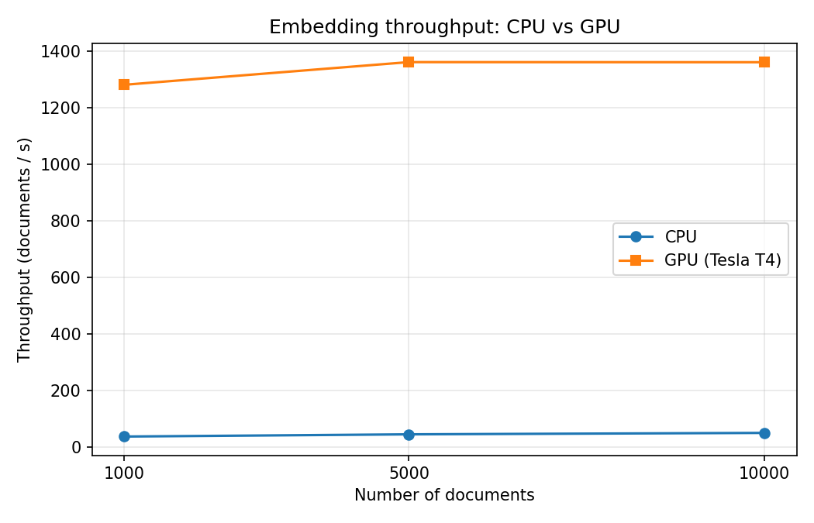
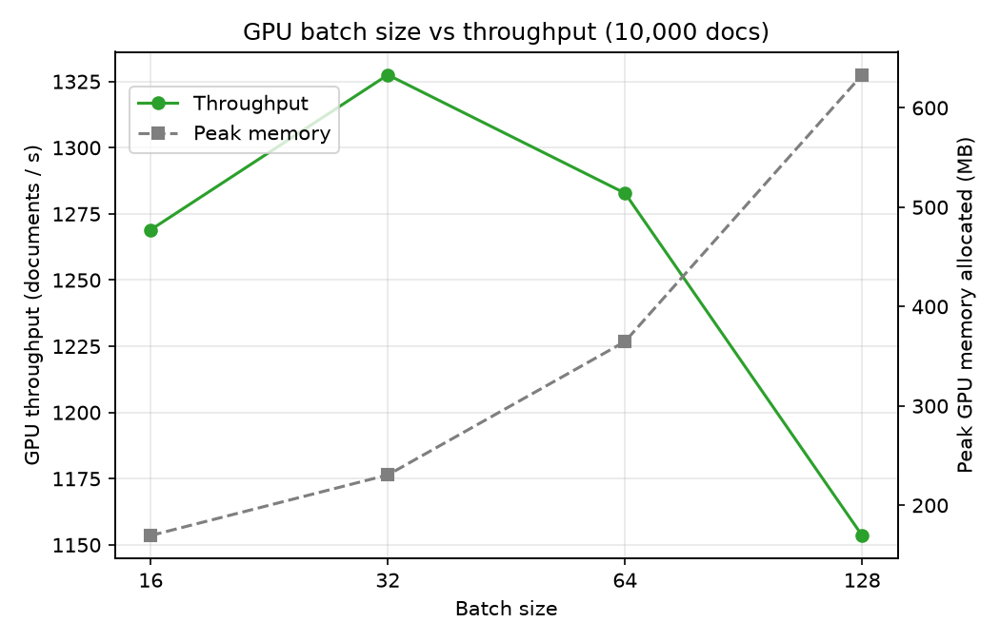

# Semantic Search with Transformer Embeddings and FAISS

This project builds a semantic-search system that retrieves documents by meaning rather than by exact keywords. Passages are encoded into 384-dimensional embeddings with the pretrained SentenceTransformer model `all-MiniLM-L6-v2` and indexed with FAISS. Natural-language queries are then matched against the index by vector similarity. The project also evaluates the performance of the embedding step on CPU and on an NVIDIA GPU (PyTorch/CUDA). It measures execution time, throughput, speedup, the effect of batch size, and memory use across dataset sizes.

> **Research question:** How does the choice of hardware (CPU vs GPU) affect the cost of generating transformer embeddings for semantic search, and does it change the search results?

## Pipeline

```text
AG News passages ──► all-MiniLM-L6-v2 ──┬── CPU
                                        └── GPU (CUDA) ──► 384-d embeddings ──► FAISS index
                                                                                    ▲
User query ──► query embedding (GPU) ───────────────────────────────────────────────┘
                                                                                    │
                                                                         Top-5 relevant documents
```

## Experiments

| # | Experiment | Setup |
|---|---|---|
| 1 | CPU vs GPU embedding generation | 1,000 / 5,000 / 10,000 docs, batch size 64 |
| 2 | GPU batch-size comparison | 10,000 docs, batch sizes 16 / 32 / 64 / 128 |
| 3 | GPU memory and throughput | peak `torch.cuda.max_memory_allocated`, `nvidia-smi` |
| 4 | Semantic-search demo | 8 example queries + keyword-search comparison |
| – | CPU/GPU equivalence check | mean absolute difference, cosine similarity, neighbor overlap |

### Methodology
- **Model:** `sentence-transformers/all-MiniLM-L6-v2`, a pretrained model with 6 layers and 384-dimensional output. It is used for inference only, with **no training**.
- **Dataset:** 12,000 unique passages sampled from [AG News](https://huggingface.co/datasets/fancyzhx/ag_news) (seed 42). The subsets are nested.
- **Warm-up:** an untimed encode runs before each configuration to exclude CUDA initialization.
- **Synchronization:** `torch.cuda.synchronize()` runs before starting and before stopping the timer, because CUDA kernels run asynchronously.
- **Repeats:** each configuration runs 3 times, and the tables report the mean (± std).
- **Metrics:**
  - Execution time
  - Throughput = documents / time
  - Speedup = CPU time / GPU time
  - Peak GPU memory
- **Hardware:** both devices run in the same Google Colab GPU runtime, so the CPU and GPU share the same host. See `results/environment.csv` for the exact hardware.

## Results

Measured on Google Colab. The GPU was a **Tesla T4** (15 GB, CUDA 13.0, PyTorch 2.11). The CPU baseline had **1 PyTorch thread** (1 physical core). Each value is the mean of 3 runs after warm-up. Raw data is in [`results/`](results/).

### 1. CPU vs GPU (batch size 64)

| Documents | CPU time (s) | GPU time (s) | CPU docs/s | GPU docs/s | Speedup |
|---:|---:|---:|---:|---:|---:|
| 1,000 | 27.13 | 0.78 | 37 | 1,280 | **34.7×** |
| 5,000 | 111.91 | 3.68 | 45 | 1,360 | **30.4×** |
| 10,000 | 200.92 | 7.35 | 50 | 1,360 | **27.3×** |




The GPU was **27–35× faster** than the CPU baseline. The speedup *decreased* slightly as the dataset grew. The T4 was already close to its maximum throughput at 1,000 documents, because a small model like MiniLM saturates it quickly. CPU throughput rose with dataset size (37 → 50 docs/s). Part of that rise comes from the first 1k CPU run, which was unusually slow (36 s vs about 22 s for the other two).

### 2. GPU batch size (10,000 documents)

| Batch size | GPU time (s) | GPU docs/s | Peak allocated (MB) | Peak reserved (MB) |
|---:|---:|---:|---:|---:|
| 16 | 7.88 | 1,269 | 170 | 230 |
| 32 | 7.53 | **1,327** | 231 | 342 |
| 64 | 7.80 | 1,283 | 365 | 558 |
| 128 | 8.67 | 1,154 | 633 | 1,046 |



Throughput peaked at batch size 32. Batch sizes 16–64 are within about 5% of each other. Batch size 128 was about 13% slower than 32 while using 2.7× the memory. This shows the trade-off between batch size, throughput and memory: past a certain point, bigger batches cost memory and give no speed. Likely causes:
- Tokenization runs on the single CPU core.
- Larger batches carry more padding, because each batch is padded to its longest text.

### 3. GPU memory

- **Model weights:** about 87 MB.
- **Peak memory:** 633 MB at batch 128, which is about 4% of the T4's 15 GB.
- **`nvidia-smi`:** reported 1,177 MB in use at the end. That figure also includes PyTorch's caching allocator and the CUDA context.

### 4. CPU/GPU equivalence

| Metric | Value |
|---|---:|
| Mean absolute difference | 3.0 × 10⁻⁸ |
| Max absolute difference | 2.2 × 10⁻⁷ |
| Min cosine similarity | 0.9999999 |
| Top-5 neighbor overlap | 100% |

The CPU and GPU embeddings are numerically equivalent. In a sample of 50 documents, the top-5 nearest neighbors were identical on both devices, so the GPU speeds up inference without changing the search results.

### 5. Semantic search

All 8 example queries returned relevant passages. After the first query, which took 94 ms because of one-time warm-up, each query embedding took about 6–11 ms on the GPU, and the FAISS search over 10,000 vectors took about 1 ms. Example:

> **Query:** *Oil prices going up because of supply problems*
> 1. High Oil Prices Might Be A Blessing In Disguise… (cos 0.725)
> 2. Tight US supplies boost oil price… (cos 0.680)
> 3. Oil Holds Above $46 Supply Worries Linger… (cos 0.636)

A keyword baseline ranked a general market report first (blue-chip stocks and the oil price), because it shared the most words with the query. Semantic search ranked articles specifically about oil *supply* first. All queries are in [`results/search_examples.csv`](results/search_examples.csv).

### Limitations
- The CPU baseline is a **single core**, which is what the free Colab tier provides. A multi-core CPU would narrow the gap, so the speedup compares a T4 with one CPU core, not with a typical modern CPU.
- The results come from one Colab session on one GPU model. Another GPU, or another session, would give different numbers.
- Batch-size differences in the 16–64 range are close to run-to-run variation (std 0.13–0.26 s).

## How to run
1. Open `gpu_semantic_search.ipynb` in [Google Colab](https://colab.research.google.com/). Use *File → Upload notebook*.
2. Go to *Runtime → Change runtime type → T4 GPU*.
3. Choose *Runtime → Run all*.

To run locally, you need an NVIDIA GPU with a CUDA-enabled PyTorch build. Then run `pip install -r requirements.txt` and `jupyter notebook`.

## Repository structure

```text
semantic-search/
├── README.md
├── gpu_semantic_search.ipynb
├── requirements.txt
├── data/documents.csv              # generated by the notebook
├── results/
│   ├── benchmark_results.csv       # all raw runs
│   ├── cpu_vs_gpu.csv
│   ├── gpu_batch_size.csv
│   ├── cpu_gpu_equivalence.csv
│   ├── search_examples.csv
│   ├── environment.csv
│   └── nvidia_smi_after.txt
└── plots/
    ├── cpu_vs_gpu_time.png
    ├── cpu_vs_gpu_throughput.png
    └── batch_size_throughput.png
```

## Scope

This project does **not** train or fine-tune a model. It uses a pretrained SentenceTransformer and focuses on applying it to semantic search and measuring its **inference** performance on CPU and GPU.
